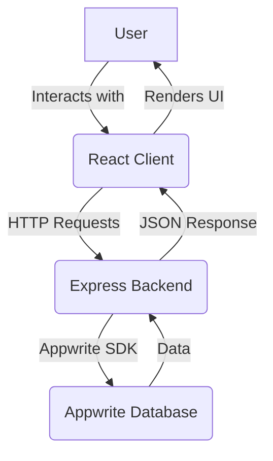

# FitTrack - Habit & Exercise Tracker

A full-stack web application designed to help users track their fitness journey, including workouts and daily habits. It provides a clean, modern interface to log exercises, monitor progress, and build consistent habits.

## 📌 Project Overview

FitTrack is a comprehensive fitness tracking application for individuals who want to systematically log their workouts and daily habits. The project was built to provide a simple yet powerful tool for users to take control of their fitness goals, with a focus on data visualization and progress monitoring.

This application is for:
- Fitness enthusiasts who want to track their workout progress over time.
- Individuals looking to build and maintain healthy habits.
- Developers interested in a modern full-stack TypeScript project with a React frontend and a Node.js/Express backend.

## ✨ Key Features

- **Workout Logging:** Log detailed information about your workouts, including exercise type, sets, reps, and weight.
- **Habit Tracking:** Define and track daily and weekly habits, and mark them as complete.
- **Interactive Dashboard:** A comprehensive dashboard that provides an at-a-glance view of your weekly progress, current streak for habits, and section-wise workout completion.
- **Progress Visualization:** Track your workout volume and other metrics over time with interactive charts.
- **Exercise Management:** Create and manage custom exercise sections to organize your workout routines.
- **Modern UI/UX:** A clean, responsive, and intuitive user interface built with React, Tailwind CSS, and Shadcn/ui.

## 🏗️ Architecture + Flow

The project follows a classic client-server architecture, with a React single-page application (SPA) for the frontend and a Node.js/Express server for the backend. The backend acts as a Backend for Frontend (BFF), communicating with Appwrite for data persistence.

### System Flow



### User Flow

1.  **View Data:** The user visits the web app. The React client fetches data from the Express backend's API endpoints.
2.  **Data Request:** The Express backend receives the request and uses the `node-appwrite` SDK to fetch data from the Appwrite database.
3.  **Data Response:** Appwrite returns the data to the backend, which then forwards it to the client as a JSON response.
4.  **Render UI:** The React client receives the JSON data and renders the UI using components like the dashboard, exercise list, and habit tracker.
5.  **Log Data:** The user submits a new workout or habit completion. The client sends a `POST` request to the backend.
6.  **Store Data:** The backend receives the data, validates it using Zod schemas, and then uses the Appwrite SDK to store the new data in the Appwrite database.

## 💻 Tech Stack

The project uses a modern, TypeScript-first tech stack.

| Category          | Technology                                                                                                                                                             |
| ----------------- | ---------------------------------------------------------------------------------------------------------------------------------------------------------------------- |
| **Frontend**      | [React](https://react.dev/), [Vite](https://vitejs.dev/), [Tailwind CSS](https://tailwindcss.com/), [shadcn/ui](https://ui.shadcn.com/), [React Query](https://tanstack.com/query/latest), [wouter](https://github.com/molefrog/wouter), [Recharts](https://recharts.org/) |
| **Backend**       | [Node.js](https://nodejs.org/), [Express.js](https://expressjs.com/), [Passport.js](http://www.passportjs.org/)                                                          |
| **Database**      | [Appwrite](https://appwrite.io/)                                                                                                                                       |
| **Deployment**    | [Vercel](https://vercel.com/), [Replit](https://replit.com/)                                                                                                           |
| **AI Integrations**| (Not specified)                                                                                                                                                      |
| **Tools**         | [TypeScript](https://www.typescriptlang.org/), [ESLint](https://eslint.org/), [Prettier](https://prettier.io/), [Drizzle ORM](https://orm.drizzle.team/) (scaffolding) |
| **MCP Servers**   | (Not applicable)                                                                                                                                                       |

## 🚀 Installation Guide

Follow these steps to set up the project locally.

### Prerequisites

- [Node.js](https://nodejs.org/) (v18 or higher)
- [npm](https://www.npmjs.com/) (v8 or higher)
- An [Appwrite](https://appwrite.io/) instance (cloud or self-hosted)

### 1. Clone the Repository

```bash
git clone https://github.com/your-username/fittrack-habit-exercise-tracker.git
cd fittrack-habit-exercise-tracker
```

### 2. Install Dependencies

```bash
npm install
```

### 3. Environment Variable Setup

Create a `.env` file in the root of the project and add the following environment variables.

```
# Appwrite Configuration
APPWRITE_ENDPOINT=https://cloud.appwrite.io/v1
APPWRITE_PROJECT_ID=your_project_id
APPWRITE_API_KEY=your_api_key
APPWRITE_DATABASE_ID=your_database_id

# Server Configuration
PORT=5000
```

### 4. Folder Structure

The project is organized into the following main directories:

- `/client`: Contains the React frontend application.
- `/server`: Contains the Node.js/Express backend server.
- `/shared`: Contains shared code, such as Zod schemas, used by both the client and server.
- `/migrations`: Contains database migration files (if using Drizzle).

## 🏃 Running the Project

### Development Mode

To start the development server for both the frontend and backend, run:

```bash
npm run dev
```

This will start the Express server and the Vite development server with hot-reloading.

### Production Mode

To build the project for production and run the optimized version:

1.  **Build the project:**

    ```bash
    npm run build
    ```

    This command builds the frontend application and transpiles the backend server code into the `dist` directory.

2.  **Start the production server:**

    ```bash
    npm run start
    ```

## 📝 API Documentation

The backend exposes a RESTful API for managing workouts, habits, and other resources.

### Example: Create a Workout

-   **Endpoint:** `POST /api/workouts`
-   **Request Body:**

    ```json
    {
      "sectionId": "your_section_id",
      "exerciseType": "Bench Press",
      "sets": 3,
      "reps": 10,
      "weight": 100,
      "unit": "kg"
    }
    ```

-   **Response Body:**

    ```json
    {
      "$id": "unique_workout_id",
      "sectionId": "your_section_id",
      "exerciseType": "Bench Press",
      "sets": 3,
      "reps": 10,
      "weight": 100,
      "unit": "kg",
      "date": "2025-11-23T10:00:00.000Z",
      "$createdAt": "2025-11-23T10:00:00.000Z",
      "$updatedAt": "2025-11-23T10:00:00.000Z",
      "$permissions": [],
      "$collectionId": "workouts_collection_id",
      "$databaseId": "your_database_id"
    }
    ```

### Error Handling

API errors are returned in the following format:

```json
{
  "error": "Error message describing the issue."
}
```

## 🏅 Best Practices

- **TypeScript First:** All code in this project is written in TypeScript to ensure type safety and improve developer experience.
- **Shared Schemas:** Zod schemas are defined in the `/shared` directory and used for validation on both the client and server, ensuring data consistency.
- **Environment Variables:** All secrets and environment-specific configurations are stored in a `.env` file and loaded at runtime.
- **Component-Based UI:** The frontend is built with a component-based architecture using React, promoting reusability and maintainability.
- **Conventional Commits:** The project follows the [Conventional Commits](https://www.conventionalcommits.org/en/v1.0.0/) specification for commit messages.

## 🚀 Future Improvements

- **User Authentication:** Implement a full authentication system to support multiple users.
- **Drizzle ORM Integration:** Complete the integration with Drizzle ORM to replace the current Appwrite dependency, allowing for more flexible database options.
- **Enhanced Analytics:** Add more detailed analytics and reporting features to provide deeper insights into user progress.
- **Social Features:** Add social features, such as sharing workouts or competing with friends.
- **Mobile App:** Develop a native mobile application for iOS and Android.