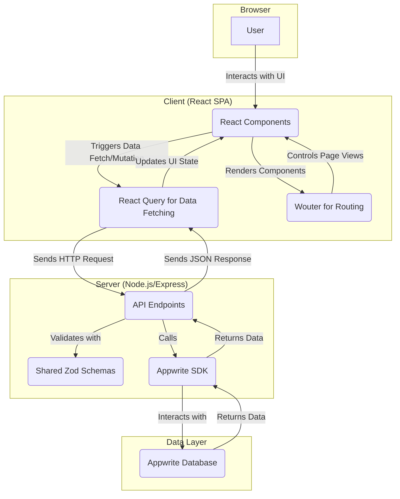

# FitTrack - Habit & Exercise Tracker

A full-stack web application designed to help users track their fitness journey, including workouts and daily habits. It provides a clean, modern interface to log exercises, monitor progress, and build consistent habits.

## 📌 Project Overview

FitTrack is a comprehensive fitness tracking application for individuals who want to systematically log their workouts and daily habits. The project was built to provide a simple yet powerful tool for users to take control of their fitness goals, with a focus on data visualization and progress monitoring.

This application is for:

- Fitness enthusiasts who want to track their workout progress over time.
- Individuals looking to build and maintain healthy habits.
- Developers interested in a modern full-stack TypeScript project with a React frontend and a Node.js/Express backend.

## ✨ Key Features

- **Workout Logging:** Log detailed information about your workouts, including exercise type, sets, reps, and weight.
- **Habit Tracking:** Define and track daily and weekly habits, and mark them as complete.
- **Interactive Dashboard:** A comprehensive dashboard that provides an at-a-glance view of your weekly progress, current streak for habits, and section-wise workout completion.
- **Progress Visualization:** Track your workout volume and other metrics over time with interactive charts.
- **Exercise Management:** Create and manage custom exercise sections to organize your workout routines.
- **Smart Habit Insights (Lag Detector):** An intelligent coach that deeply analyzes your Google Tasks history. It identifies winning streaks, friction points (lags), and provides actionable "Next Step" recommendations based on your current focus. It effectively handles deadlines and subtasks to give you a complete picture.
- **Deep Google Tasks Integration:** Seamlessly syncs with Google Tasks. Supports extensive features including creating lists, managing deadlines (defaulting to EOD), and full hierarchical subtask support with recursive rendering.
- **Voice Workout Logging:** Hands-free workout logging using AI. Simply speak your exercises, sets, reps, and weights, and the system automatically parses and logs them using Google Gemini's multimodal capabilities.
- **Modern UI/UX:** A clean, responsive, and intuitive user interface built with React, Tailwind CSS, and Shadcn/ui.

## 🏗️ Architecture and High-Level Flow

This project is built on a **monolithic architecture** with a clear separation of concerns between the frontend and backend, all within a single repository. This design simplifies development and deployment while maintaining a structured and scalable codebase.

The backend is a **Node.js/Express server** that functions as a **Backend for Frontend (BFF)**. It serves the static frontend assets and provides a RESTful API for all data operations. The frontend is a **React Single-Page Application (SPA)**, built with Vite, that offers a dynamic and responsive user experience.

### System Architecture Diagram

The following diagram illustrates the high-level architecture of the system:



### Data and User Flow

1.  **Initial Load**: When a user accesses the site, the Express server serves the initial `index.html` and the bundled React application.
2.  **Client-Side Routing**: The React app takes over, and `wouter` manages all subsequent URL changes and component rendering without full page reloads.
3.  **Data Fetching**:
    - React components use `useQuery` from **React Query** to fetch data from the backend API (e.g., `/api/workouts`).
    - The Express server receives the request, validates it, and uses the **Appwrite SDK** to query the Appwrite database.
    - The backend sends the data back to the client as a JSON response.
    - React Query caches the data, manages the loading/error states, and updates the UI.
4.  **Data Mutation**:
    - When a user performs an action (e.g., adding a new habit), the client uses `useMutation` from React Query to send a `POST`, `PUT`, or `DELETE` request to the backend.
    - The backend validates the incoming data against **Zod schemas** located in the `/shared` directory to ensure type safety and consistency.
    - If valid, the data is persisted to the Appwrite database.
    - The backend confirms the successful operation, and React Query automatically re-fetches the relevant data to keep the UI in sync.

## 🔄 User Workflows

### Voice Logging a Workout
1.  Navigate to the **Exercises** page.
2.  Select the desired **Week** and **Workout Section** (e.g., "Legs").
3.  Click the **Microphone** icon in the "Voice Logging" card.
4.  Speak your workout details (e.g., *"I did 3 sets of Bench Press for 10 reps with 60kg"*).
5.  Click the **Stop** button.
6.  The audio is uploaded and processed directly by **Google Gemini** using its multimodal capabilities to extract workout data. The workout is automatically added to your list!

## 💻 Tech Stack

This project is built with a modern, TypeScript-first tech stack designed for performance, scalability, and an excellent developer experience.

| Category       | Technology                                                   | Description                                                                                                |
| -------------- | ------------------------------------------------------------ | ---------------------------------------------------------------------------------------------------------- |
| **Frontend**   | [React](https://react.dev/)                                  | A JavaScript library for building user interfaces.                                                         |
|                | [Vite](https://vitejs.dev/)                                  | A next-generation frontend tooling that provides a faster and leaner development experience.               |
|                | [Tailwind CSS](https://tailwindcss.com/)                     | A utility-first CSS framework for rapidly building custom designs.                                         |
|                | [shadcn/ui](https://ui.shadcn.com/)                          | A collection of beautifully designed, accessible, and customizable React components.                       |
|                | [React Query](https://tanstack.com/query/latest)             | A powerful data-fetching and state management library for React.                                           |
|                | [wouter](https://github.com/molefrog/wouter)                 | A minimalist routing library for React.                                                                    |
|                | [Recharts](https://recharts.org/)                            | A composable charting library built on React components.                                                   |
| **Backend**    | [Node.js](https://nodejs.org/)                               | A JavaScript runtime built on Chrome's V8 JavaScript engine.                                               |
|                | [Express.js](https://expressjs.com/)                         | A minimal and flexible Node.js web application framework.                                                  |
| **Database**   | [Appwrite](https://appwrite.io/)                             | An open-source backend-as-a-service platform that provides database, authentication, and storage services. |

- [Node.js](https://nodejs.org/) (v18 or higher)
- [npm](https://www.npmjs.com/) (v8 or higher)
- An [Appwrite](https://appwrite.io/) instance (cloud or self-hosted)

### 1. Clone the Repository

```bash
git clone https://github.com/your-username/fittrack-habit-exercise-tracker.git
cd fittrack-habit-exercise-tracker
```

### 2. Install Dependencies

```bash
npm install
```

### 3. Environment Variable Setup

Create a `.env` file in the root of the project and add the following environment variables. These are essential for connecting to your Appwrite instance and running the server.

```
# Appwrite Configuration
# Replace with your Appwrite instance details
APPWRITE_ENDPOINT=https://cloud.appwrite.io/v1
APPWRITE_PROJECT_ID=your_project_id
APPWRITE_API_KEY=your_api_key
APPWRITE_DATABASE_ID=your_database_id

# Server Configuration
# The port on which the Express server will run
PORT=5000

# AI Configuration
GEMINI_API_KEY=your_gemini_key

```

### 4. Project Structure

The project is organized into a monorepo structure with distinct directories for the client, server, and shared code. This separation helps maintain a clean and organized codebase.

```
/
├── client/         # React frontend application
│   ├── src/
│   │   ├── components/ # Reusable UI components
│   │   ├── pages/      # Top-level page components
│   │   ├── lib/        # Utility functions and libraries
│   │   └── App.tsx     # Main application component
│   └── index.html      # Entry point for the frontend
│
├── server/         # Node.js/Express backend
│   ├── app.ts      # Express application setup
│   ├── routes.ts   # API route definitions
│   └── index-dev.ts  # Development server entry point
│
├── shared/         # Code shared between client and server
│   └── schema.ts   # Zod schemas for data validation
│
├── .env.example    # Example environment variables
├── package.json    # Project dependencies and scripts
└── README.md       # Project documentation
```

- **`/client`**: This directory contains the entire React frontend. All components, pages, hooks, and styles related to the user interface are located here.
- **`/server`**: This is where the Node.js/Express backend lives. It handles API requests, interacts with the database, and serves the frontend.
- **`/shared`**: This directory contains code that is used by both the client and the server. This is particularly useful for sharing data structures and validation schemas (like Zod schemas) to ensure consistency across the stack.
- **`/migrations`**: If you were using a traditional SQL database with Drizzle ORM, this folder would contain the database migration files.

## 🏃 Running the Project

### Development Mode

To start the development server for both the frontend and backend, run:

```bash
npm run dev
```

This will start the Express server and the Vite development server with hot-reloading.

### Production Mode

To build the project for production and run the optimized version:

1.  **Build the project:**

    ```bash
    npm run build
    ```

    This command builds the frontend application and transpiles the backend server code into the `dist` directory.

2.  **Start the production server:**

    ```bash
    npm run start
    ```

## 📝 API Documentation

The backend exposes a RESTful API for managing workouts, habits, and other resources.

### Example: Create a Workout

- **Endpoint:** `POST /api/workouts`
- **Request Body:**

  ```json
  {
    "sectionId": "your_section_id",
    "exerciseType": "Bench Press",
    "sets": 3,
    "reps": 10,
    "weight": 100,
    "unit": "kg"
  }
  ```

- **Response Body:**

  ```json
  {
    "$id": "unique_workout_id",
    "sectionId": "your_section_id",
    "exerciseType": "Bench Press",
    "sets": 3,
    "reps": 10,
    "weight": 100,
    "unit": "kg",
    "date": "2025-11-23T10:00:00.000Z",
    "$createdAt": "2025-11-23T10:00:00.000Z",
    "$updatedAt": "2025-11-23T10:00:00.000Z",
    "$permissions": [],
    "$collectionId": "workouts_collection_id",
    "$databaseId": "your_database_id"
  }
  ```

### Voice Log Workout

- **Endpoint:** `POST /api/voice-log`
- **Headers:** `Content-Type: multipart/form-data`
- **Request Body:**
  - `audio`: The audio file (webm/mp3/wav).
  - `sectionId`: (Optional) The ID of the workout section.
  - `date`: (Optional) ISO date string for the workout.
- **Response Body:**
  ```json
  {
    "transcription": "Squats 3 sets of 10 reps 100 kg",
    "workouts": [
      {
        "id": "workout_id",
        "exerciseType": "Squats",
        "sets": 3,
        "reps": 10,
        "weight": 100,
        "unit": "kg"
      }
    ]
  }
  ```

### Error Handling

API errors are returned in the following format:

```json
{
  "error": "Error message describing the issue."
}
```

## 🏅 Best Practices

- **TypeScript First:** All code in this project is written in TypeScript to ensure type safety and improve developer experience.
- **Shared Schemas:** Zod schemas are defined in the `/shared` directory and used for validation on both the client and server, ensuring data consistency.
- **Environment Variables:** All secrets and environment-specific configurations are stored in a `.env` file and loaded at runtime.
- **Component-Based UI:** The frontend is built with a component-based architecture using React, promoting reusability and maintainability.
- **Conventional Commits:** The project follows the [Conventional Commits](https://www.conventionalcommits.org/en/v1.0.0/) specification for commit messages.

## 🚀 Future Improvements

- **Drizzle ORM Integration:** Complete the integration with Drizzle ORM to replace the current Appwrite dependency, allowing for more flexible database options.
- **Drizzle ORM Integration:** Complete the integration with Drizzle ORM to replace the current Appwrite dependency, allowing for more flexible database options.
- **Enhanced Analytics:** Add more detailed analytics and reporting features to provide deeper insights into user progress.
- **Social Features:** Add social features, such as sharing workouts or competing with friends.
- **Mobile App:** Develop a native mobile application for iOS and Android.
